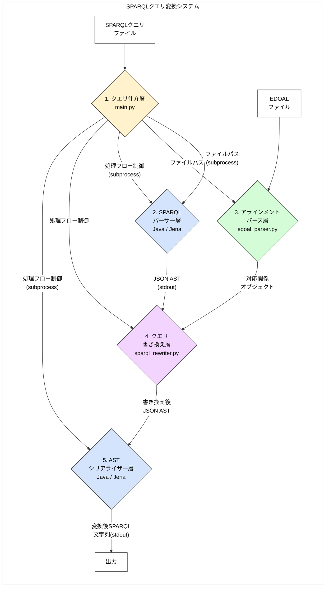
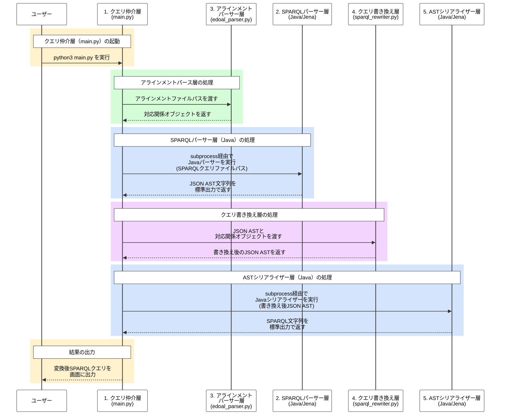

# SPARQLクエリ変換システム 仕様書

## 1. 概要

本システムは、ソースオントロジーに基づいて記述されたSPARQLクエリを、EDOAL形式のアラインメントファイルを用いて、ターゲットオントロジーに基づいたSPARQLクエリに変換することを目的とします。

この変換は、SPARQLクエリを一度JSON形式のAST（抽象構文木）に変換し、そのASTをアラインメント情報に基づいて書き換えた後、再度SPARQLクエリ文字列に再構築することで、堅牢かつ拡張性の高い変換を実現します。

## 2. システムアーキテクチャ

本システムは、JavaとPythonのハイブリッドアプローチを採用した、以下の4層からなるパイプラインアーキテクチャで構成されています。


### アーキテクチャのポイント

-   **ハイブリッド構成:** SPARQLのパースという複雑で安定性が求められる処理を、実績のあるJavaライブラリ（Apache Jena）に任せています。一方、書き換えロジックや全体の処理フロー制御は、柔軟で記述しやすいPythonで行うことで、両言語の長所を活かしています。
-   **ASTベースの書き換え:** クエリを一度AST（抽象構文木）に変換することで、文字列のパターンマッチング（正規表現など）では困難な、文脈を考慮した正確な書き換えを実現します。
-   **疎結合なコンポーネント:** 各層は明確に分離されており、それぞれの役割に特化しています。例えば、将来的にSPARQLパーサーを別の実装に置き換えたくなった場合でも、同じJSON AST形式を出力するようにすれば、他のコンポーネントに影響を与えることなく差し替えが可能です。

## 3. コンポーネント詳細

### 3.1. クエリ仲介層 (Mediator)

-   **パス:** [`main.py`](main.py)
-   **役割:**
    -   システム全体のエントリーポイント。
    -   設定ファイル（アラインメントファイルパス、SPARQLクエリパスなど）を読み込みます。
    -   各層（パーサー、リライター、シリアライザー）を適切な順序で呼び出し、データを受け渡すことで、変換プロセス全体のフローを制御します。

### 3.2. SPARQLパーサー層 (SPARQL Parser)

-   **パス:**
    -   Java実装: [`src/main/java/sparql_parser_java/SparqlAstParser.java`](src/main/java/sparql_parser_java/SparqlAstParser.java), [`src/main/java/sparql_parser_java/AstVisitor.java`](src/main/java/sparql_parser_java/AstVisitor.java)
    -   Pythonラッパー: [`sparql_translator/src/parser/sparql_ast_parser.py`](sparql_translator/src/parser/sparql_ast_parser.py)
-   **役割:**
    -   **Java実装:** Apache Jena (ARQ) を利用してSPARQLクエリをパースし、その構文木をJSONでシリアライズ可能な中間表現（Map/List）に変換して、標準出力に書き出します。ビルドにはGradleを使用します。
    -   **拡張機能 (2025年11月):** クエリタイプ（SELECT/ASK/CONSTRUCT等）、DISTINCT指定、SELECT変数リスト、ORDER BY句、LIMIT/OFFSET句などのクエリレベル情報をASTに含めるよう拡張されました。
    -   **Pythonラッパー:** Pythonの `subprocess` モジュールを使い、内部でJavaプログラムを呼び出します。Javaプログラムが出力したJSON文字列を受け取り、Pythonの辞書オブジェクトに変換して返します。他のPythonモジュールは、このラッパーを通じてASTを取得します。

### 3.3. アラインメントパース層 (Alignment Parser)

-   **パス:** [`sparql_translator/src/parser/edoal_parser.py`](sparql_translator/src/parser/edoal_parser.py)
-   **役割:**
    -   EDOAL形式で記述されたXMLアラインメントファイルをパースします。
    -   ファイル内の各対応関係 (`<Cell>`) を、その構造（単純なURI、`AttributeDomainRestriction` などの複雑な表現）を維持したまま、Pythonのデータクラスオブジェクトのリストに変換します。
-   **対応するEDOAL構造 (2025年11月時点):**
    -   **基本的なURI対応:** クラス、プロパティ、リレーションの直接的なURI対応
    -   **AttributeDomainRestriction:** 属性の定義域制約（クラス + プロパティの組み合わせ）
    -   **AttributeValueRestriction:** 属性値の制約（プロパティ + 特定の値）
    -   **AttributeOccurenceRestriction:** 属性の出現回数制約（minOccurs, maxOccurs）
    -   **RelationDomainRestriction:** リレーションの定義域制約
    -   **RelationCoDomainRestriction:** リレーションの値域制約
    -   **LogicalConstructor:** 論理演算子（and, or）による複数条件の組み合わせ
    -   **PathConstructor:** パス構造（compose: プロパティ連鎖、inverse: 逆方向プロパティ）
    -   **複合パターン:** `edoal:or` と `edoal:compose` のネスト構造（2025年11月17日対応）

### 3.4. クエリ書き換え層 (Rewriter)

-   **パス:**
    -   基本骨格: [`sparql_translator/src/rewriter/ast_walker.py`](sparql_translator/src/rewriter/ast_walker.py)
    -   具体的実装: [`sparql_translator/src/rewriter/sparql_rewriter.py`](sparql_translator/src/rewriter/sparql_rewriter.py)
-   **役割:**
    -   **`AstWalker`:** Visitorパターンに基づき、JSON ASTの木構造を再帰的に巡回するための基本クラス。ノードの `type` に応じて `visit_...` メソッドを呼び出すディスパッチ機能を提供します。
    -   **`SparqlRewriter`:** `AstWalker` を継承した具体的な書き換えクラス。初期化時にアラインメントパーサーが生成した対応関係オブジェクトを受け取ります。`visit_uri` や `visit_triple` といったメソッドをオーバーライドし、ASTノードが対応関係に合致した場合に、それを新しいノード（またはノードのリスト）に書き換えるロジックを実装します。
-   **書き換え機能 (2025年11月時点):**
    -   **クラス書き換え:** 主語・目的語のクラスURIを対応するターゲットクラスに変換
    -   **プロパティ書き換え:** 述語のプロパティURIを対応するターゲットプロパティに変換
    -   **複雑なエンティティ展開:**
        -   `AttributeDomainRestriction`: クラス制約付きプロパティ → UNION構造
        -   `AttributeValueRestriction`: 特定値制約 → FILTER追加
        -   `AttributeOccurenceRestriction`: 出現回数制約 → OPTIONAL構造
        -   `LogicalConstructor (or)`: OR条件 → UNION構造
        -   `LogicalConstructor (and)`: AND条件 → 複数トリプル展開
    -   **複雑なリレーション展開:**
        -   `RelationDomainRestriction`: 定義域制約 → 主語側の型制約追加
        -   `RelationCoDomainRestriction`: 値域制約 → 目的語側の型制約追加
        -   `PathConstructor (inverse)`: 逆プロパティ → 主語・目的語を入れ替え
        -   `PathConstructor (compose)`: プロパティ連鎖 → 中間変数を使った複数トリプル展開（2025年11月17日対応）
-   **デバッグモード (verbose):** コンストラクタに `verbose=True` を渡すことで、パースと書き換えの詳細ログを出力可能（2025年11月17日追加）

### 3.5. ASTシリアライザー層 (Serializer)

-   **パス:**
    -   Java実装: [`src/main/java/sparql_serializer_java/SparqlAstSerializer.java`](src/main/java/sparql_serializer_java/SparqlAstSerializer.java)
    -   Pythonラッパー: [`sparql_translator/src/rewriter/ast_serializer.py`](sparql_translator/src/rewriter/ast_serializer.py)
-   **役割:**
    -   クエリ書き換え層によって変更されたJSON ASTを入力として受け取ります。
    -   ASTを再帰的に解釈し、再び実行可能なSPARQLクエリ文字列に再構築（シリアライズ）します。
-   **Java移行 (2025年11月):**
    -   従来のPython実装から、Apache Jena (ARQ) を使用したJava実装に移行しました。
    -   これにより、SELECT句の変数情報の保持（SELECT ?rank問題の解決）、FILTER構文の正確な再構築などの問題が解消されました。
    -   Python側は `subprocess` 経由でJavaプログラムを呼び出すラッパーとして機能します。

## 4. 実行方法

1.  **ビルド (初回のみ):**
    ```bash
    ./gradlew build
    ```
2.  **実行:**
    ```bash
    python3 main.py
    ```
    *   ※ `main.py` 内のファイルパスを書き換えることで、異なるクエリやアラインメントファイルを対象にすることができます。

## 5. 処理フロー (階段図)

以下に、`main.py` を実行した際の、システム内部におけるデータの流れを階段状に示します。



## 6. 変換品質の評価

本システムでは、変換されたクエリの品質をURIベースの判定ロジックで評価します。

### 6.1. 判定基準

変換が成功したと判定されるには、以下の3つの条件をすべて満たす必要があります：

1. **出力存在:** `output_query` が空でないこと
2. **ソースURI非残存:** 元のクエリに含まれていたソースオントロジーのURIが、変換後のクエリに残存していないこと
3. **ターゲットURI含有:** アラインメントファイルで定義されたターゲットオントロジーのURIが、変換後のクエリに含まれていること

### 6.2. URI抽出

判定に使用するURIは、以下の方法で抽出されます：

-   **フルURI形式:** `<http://example.org/resource>` のような形式
-   **短縮形URI:** PREFIX宣言で定義された名前空間を展開（例: `ex:Resource` → `http://example.org/Resource`）
-   **標準名前空間の除外:** `rdf:`, `rdfs:`, `xsd:`, `owl:` などの標準的な名前空間は評価対象外

## 7. 実装成果 (2025年11月時点)

### 7.1. 変換成功率

-   **総合成功率:** 81.82% (18/22クエリ)
-   **データセット別:**
    -   taxons: 100% (5/5) ✨
    -   conference: 83.3% (5/6)
    -   agro-db: 80.0% (4/5)
    -   agronomic-voc: 66.7% (4/6)

### 7.2. 失敗クエリの分類

1. **アラインメント不足 (1件):**
   -   conference/query_4: 必要なマッピング（`:writtenBy` → `cmt:writePaper`）が存在しない
   -   これは正常な失敗であり、アラインメントファイルを追加することで解決可能

2. **プロパティパス未対応 (3件):**
   -   agronomic-voc/query_0, query_2
   -   agro-db/query_2
   -   SPARQL 1.1のプロパティパス構文（`+`, `*`, `/` 等）の変換は未実装

## 7.3. 新機能: edoal:or と edoal:compose の複合パターン対応 (2025年11月17日)

### 7.3.1. 背景

従来のリライター実装では、`edoal:or` (UNION) と `edoal:compose` (プロパティ連鎖) の複合パターンで以下の問題が発生していました：

1. **PathConstructor の無視**: `_expand_complex_relation` メソッドが `IdentifiedEntity` のみ処理し、`PathConstructor` を無視
2. **変数スコープの断絶**: compose 展開時に生成される中間変数が、元のクエリ変数と接続されず、FILTER句が機能しない

### 7.3.2. 実装内容

#### パーサー層の拡張 (`edoal_parser.py`)

```python
class EdoalParser:
    def __init__(self, file_path, verbose=False):
        self.verbose = verbose
        # ...
    
    def _parse_entity(self, element):
        # verbose=True 時にパース情報を出力
        if self.verbose:
            print(f"[DEBUG] Parsing {op} with {len(operands)} operands")
```

#### リライター層の拡張 (`sparql_rewriter.py`)

**1. PathConstructor の型チェック追加:**

```python
def _expand_complex_relation(self, triple, relation):
    if isinstance(relation, LogicalConstructor) and relation.op == 'or':
        for operand in relation.operands:
            if isinstance(operand, PathConstructor):
                # compose / inverse の処理
                if operand.op == 'compose':
                    triples = self._expand_compose_path(...)
                elif operand.op == 'inverse':
                    # 主語・目的語を入れ替え
```

**2. 新メソッド `_expand_compose_path`:**

プロパティ連鎖を中間変数で展開し、始点（subject_node）と終点（object_node）を保持：

```python
def _expand_compose_path(self, compose_constructor, subject_node, object_node):
    properties = compose_constructor.operands
    current_subject = subject_node  # 元の主語を起点
    
    for i, prop in enumerate(properties[:-1]):
        temp_var = self._generate_temp_variable()
        triples.append(create_triple(current_subject, prop.uri, temp_var))
        current_subject = temp_var  # 次のトリプルの主語
    
    # 最後のプロパティは元の目的語に接続
    last_prop = properties[-1]
    triples.append(create_triple(current_subject, last_prop.uri, object_node))
```

### 7.3.3. 変換例

**EDOAL マッピング:**
```xml
<edoal:or>
  <edoal:entity rdf:about="http://example.org/name"/>
  <edoal:compose>
    <edoal:entity rdf:about="http://example.org/prefLabel"/>
    <edoal:entity rdf:about="http://example.org/literalForm"/>
  </edoal:compose>
</edoal:or>
```

**元のクエリ:**
```sparql
SELECT ?taxon ?label
WHERE {
  ?taxon agro:scientificName ?label .
  FILTER(regex(str(?label), "Wheat"))
}
```

**変換後のクエリ:**
```sparql
SELECT ?taxon ?label
WHERE {
  {
    ?taxon <http://example.org/name> ?label .
  } UNION {
    ?taxon <http://example.org/prefLabel> ?temp0 .
    ?temp0 <http://example.org/literalForm> ?label .
  }
  FILTER(regex(str(?label), "Wheat"))
}
```

**ポイント:**
- ✅ UNION 構造が正しく生成
- ✅ compose が `?taxon → ?temp0 → ?label` に展開
- ✅ FILTER が元の変数 `?label` を正しく参照

### 7.3.4. テスト結果

実データ（`agronomic-voc/alignment.edoal` + クエリファイル）で検証：

| テストケース | 検証項目 | 結果 |
|------------|---------|-----|
| query_1.sparql | UNION生成 + FILTER変数追跡 | ✅ 成功 |
| query_4.sparql | 複数ブランチのUNION | ✅ 成功 |
| query_5.sparql | compose連鎖 + 型チェック | ✅ 成功 |

### 7.3.5. verbose モード

デバッグ用に詳細ログを出力可能：

```python
# 詳細ログ出力
parser = EdoalParser("alignment.edoal", verbose=True)
rewriter = SparqlRewriter(ast, parser.cells, verbose=True)

# 本番環境（ログ抑制）
parser = EdoalParser("alignment.edoal", verbose=False)
rewriter = SparqlRewriter(ast, parser.cells, verbose=False)
```

**出力例（verbose=True）:**
```
[DEBUG] Parsing 'or' with 5 operands
[Info] Matched relation: agro:scientificName → (or with 5 operands)
[Info] Creating UNION with 5 branches
```

## 8. 既知の制限事項と将来の拡張

### 8.1. 現在の制限事項

1. **プロパティパス未対応:**
   -   `agro:hasLowerRank+` （1回以上の繰り返し）
   -   `agro:hasHigherRank*` （0回以上の繰り返し）
   -   `agro:parentTaxon / agro:scientificName` （パスの連結）
   -   これらの構文は現在のリライターでは処理できません。

2. **複雑なFILTER式の書き換え:**
   -   FILTER内でソースオントロジーのURIが使用されている場合、その書き換えは部分的にのみサポートされています。

3. **UNION/OPTIONAL/FILTERの最適化:**
   -   複雑なマッピングの展開により、冗長なUNION/OPTIONAL構造が生成される場合があります。

### 8.2. 将来の実装候補

1. **プロパティパス対応:**
   -   パーサー層: プロパティパスのASTノード構造を定義
   -   リライター層: パス要素ごとのマッピング適用ロジック
   -   シリアライザー層: プロパティパス構文の再構築

2. **FILTER式内のURI書き換え:**
   -   FILTER式の構文木解析
   -   式内に出現するURIの検出と書き換え

3. **クエリ最適化:**
   -   意味的に等価なUNION構造の統合
   -   不要なOPTIONAL句の削除
   -   FILTER条件の最適化

4. **CONSTRUCT/ASK/DESCRIBE対応:**
   -   現在はSELECTクエリに最適化されていますが、他のクエリ形式への対応も検討の余地があります。

5. **双方向マッピング:**
   -   現在はソース→ターゲット方向のみですが、逆方向の変換もサポート

6. **マッピング推論:**
   -   アラインメントファイルに明示的に記述されていないマッピングを、オントロジーの構造から推論