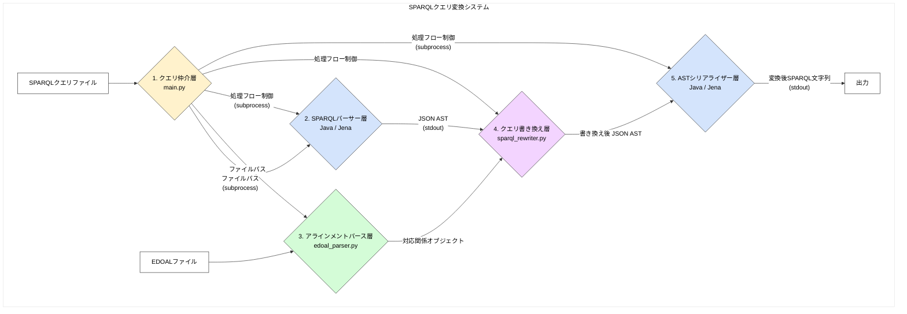

```mermaid
%%{init: {'theme':'base', 'themeVariables': { 'primaryColor':'#fff','primaryTextColor':'#000','primaryBorderColor':'#333','lineColor':'#333','secondaryColor':'#fff','tertiaryColor':'#fff','background':'#fff','mainBkg':'#fff','secondBkg':'#fff'}}}%%
graph TD
    subgraph SPARQLクエリ変換システム
        A[SPARQLクエリファイル] --> B{1. クエリ仲介層<br>main.py};
        B -- "ファイルパス<br>(subprocess)" --> C{2. SPARQLパーサー層<br>Java / Jena};
        C -- "JSON AST<br>(stdout)" --> D{4. クエリ書き換え層<br>sparql_rewriter.py};
        E[EDOALファイル] --> F{3. アラインメントパース層<br>edoal_parser.py};
        F -- 対応関係オブジェクト --> D;
        D -- 書き換え後 JSON AST --> G{5. ASTシリアライザー層<br>Java / Jena};
        G -- "変換後SPARQL文字列<br>(stdout)" --> H[出力];
        B -- ファイルパス --> F;
        B -- "処理フロー制御<br>(subprocess)" --> C;
        B -- 処理フロー制御 --> D;
        B -- "処理フロー制御<br>(subprocess)" --> G;
    end

    classDef mediator fill:#fff2cc,stroke:#333,stroke-width:1px;
    classDef javaLayer fill:#d4e4fc,stroke:#333,stroke-width:1px;
    classDef alignment fill:#d4fcd7,stroke:#333,stroke-width:1px;
    classDef rewriter fill:#f3d4ff,stroke:#333,stroke-width:1px;
    classDef default fill:#ffffff,stroke:#333,stroke-width:1px;

    class B mediator;
    class C,G javaLayer;
    class F alignment;
    class D rewriter;
    class A,E,H default;
```
