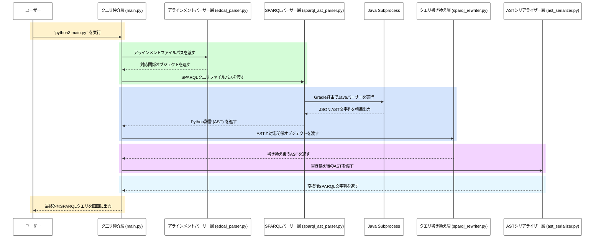

```mermaid
%%{init: {'theme':'base', 'themeVariables': { 'actorBkg':'#ffffff','actorBorder':'#333','actorTextColor':'#000','actorLineColor':'#333','signalColor':'#333','signalTextColor':'#000','labelBoxBkgColor':'#fff','labelBoxBorderColor':'#333','labelTextColor':'#000','loopTextColor':'#000','noteBorderColor':'#333','noteBkgColor':'#fff','noteTextColor':'#000','activationBorderColor':'#333','activationBkgColor':'#f4f4f4','sequenceNumberColor':'#fff'}}}%%
sequenceDiagram
    participant User as ユーザー
    participant Main as クエリ仲介層 (main.py)
    participant EParser as アラインメントパーサー層 (edoal_parser.py)
    participant SParser as SPARQLパーサー層 (sparql_ast_parser.py)
    participant Java as Java Subprocess
    participant Rewriter as クエリ書き換え層 (sparql_rewriter.py)
    participant Serializer as ASTシリアライザー層 (ast_serializer.py)

    rect rgb(255, 242, 204)
    User->>Main: `python3 main.py` を実行
    end
    
    rect rgb(212, 252, 215)
    Main->>EParser: アラインメントファイルパスを渡す
    EParser-->>Main: 対応関係オブジェクトを返す
    Main->>SParser: SPARQLクエリファイルパスを渡す
    end
    
    rect rgb(212, 228, 252)
    SParser->>Java: Gradle経由でJavaパーサーを実行
    Java-->>SParser: JSON AST文字列を標準出力
    SParser-->>Main: Python辞書 (AST) を返す
    Main->>Rewriter: ASTと対応関係オブジェクトを渡す
    end
    
    rect rgb(243, 212, 255)
    Rewriter-->>Main: 書き換え後のASTを返す
    Main->>Serializer: 書き換え後のASTを渡す
    end
    
    rect rgb(230, 247, 255)
    Serializer-->>Main: 変換後SPARQL文字列を返す
    end
    
    rect rgb(255, 242, 204)
    Main-->>User: 最終的なSPARQLクエリを画面に出力
    end
```
