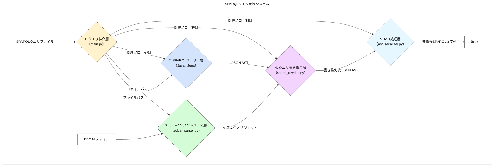
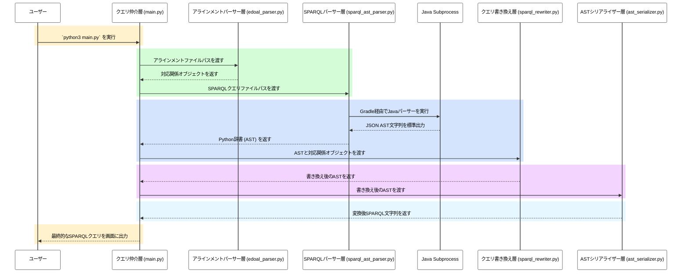

# SPARQLクエリ変換システム 仕様書

## 1. 概要

本システムは、ソースオントロジーに基づいて記述されたSPARQLクエリを、EDOAL形式のアラインメントファイルを用いて、ターゲットオントロジーに基づいたSPARQLクエリに変換することを目的とします。

この変換は、SPARQLクエリを一度JSON形式のAST（抽象構文木）に変換し、そのASTをアラインメント情報に基づいて書き換えた後、再度SPARQLクエリ文字列に再構築することで、堅牢かつ拡張性の高い変換を実現します。

## 2. システムアーキテクチャ

本システムは、JavaとPythonのハイブリッドアプローチを採用した、以下の4層からなるパイプラインアーキテクチャで構成されています。


### アーキテクチャのポイント

-   **ハイブリッド構成:** SPARQLのパースという複雑で安定性が求められる処理を、実績のあるJavaライブラリ（Apache Jena）に任せています。一方、書き換えロジックや全体の処理フロー制御は、柔軟で記述しやすいPythonで行うことで、両言語の長所を活かしています。
-   **ASTベースの書き換え:** クエリを一度AST（抽象構文木）に変換することで、文字列のパターンマッチング（正規表現など）では困難な、文脈を考慮した正確な書き換えを実現します。
-   **疎結合なコンポーネント:** 各層は明確に分離されており、それぞれの役割に特化しています。例えば、将来的にSPARQLパーサーを別の実装に置き換えたくなった場合でも、同じJSON AST形式を出力するようにすれば、他のコンポーネントに影響を与えることなく差し替えが可能です。

## 3. コンポーネント詳細

### 3.1. クエリ仲介層 (Mediator)

-   **パス:** [`main.py`](main.py)
-   **役割:**
    -   システム全体のエントリーポイント。
    -   設定ファイル（アラインメントファイルパス、SPARQLクエリパスなど）を読み込みます。
    -   各層（パーサー、リライター、シリアライザー）を適切な順序で呼び出し、データを受け渡すことで、変換プロセス全体のフローを制御します。

### 3.2. SPARQLパーサー層 (SPARQL Parser)

-   **パス:**
    -   Java実装: [`src/main/java/sparql_parser_java/SparqlAstParser.java`](src/main/java/sparql_parser_java/SparqlAstParser.java), [`src/main/java/sparql_parser_java/AstVisitor.java`](src/main/java/sparql_parser_java/AstVisitor.java)
    -   Pythonラッパー: [`sparql_translator/src/parser/sparql_ast_parser.py`](sparql_translator/src/parser/sparql_ast_parser.py)
-   **役割:**
    -   **Java実装:** Apache Jena (ARQ) を利用してSPARQLクエリをパースし、その構文木をJSONでシリアライズ可能な中間表現（Map/List）に変換して、標準出力に書き出します。ビルドにはGradleを使用します。
    -   **Pythonラッパー:** Pythonの `subprocess` モジュールを使い、内部でJavaプログラムを呼び出します。Javaプログラムが出力したJSON文字列を受け取り、Pythonの辞書オブジェクトに変換して返します。他のPythonモジュールは、このラッパーを通じてASTを取得します。

### 3.3. アラインメントパース層 (Alignment Parser)

-   **パス:** [`sparql_translator/src/parser/edoal_parser.py`](sparql_translator/src/parser/edoal_parser.py)
-   **役割:**
    -   EDOAL形式で記述されたXMLアラインメントファイルをパースします。
    -   ファイル内の各対応関係 (`<Cell>`) を、その構造（単純なURI、`AttributeDomainRestriction` などの複雑な表現）を維持したまま、Pythonのデータクラスオブジェクトのリストに変換します。

### 3.4. クエリ書き換え層 (Rewriter)

-   **パス:**
    -   基本骨格: [`sparql_translator/src/rewriter/ast_walker.py`](sparql_translator/src/rewriter/ast_walker.py)
    -   具体的実装: [`sparql_translator/src/rewriter/sparql_rewriter.py`](sparql_translator/src/rewriter/sparql_rewriter.py)
-   **役割:**
    -   **`AstWalker`:** Visitorパターンに基づき、JSON ASTの木構造を再帰的に巡回するための基本クラス。ノードの `type` に応じて `visit_...` メソッドを呼び出すディスパッチ機能を提供します。
    -   **`SparqlRewriter`:** `AstWalker` を継承した具体的な書き換えクラス。初期化時にアラインメントパーサーが生成した対応関係オブジェクトを受け取ります。`visit_uri` や `visit_triple` といったメソッドをオーバーライドし、ASTノードが対応関係に合致した場合に、それを新しいノード（またはノードのリスト）に書き換えるロジックを実装します。

### 3.5. ASTシリアライザー層 (Serializer)

-   **パス:** [`sparql_translator/src/rewriter/ast_serializer.py`](sparql_translator/src/rewriter/ast_serializer.py)
-   **役割:**
    -   クエリ書き換え層によって変更されたJSON ASTを入力として受け取ります。
    -   ASTを再帰的に解釈し、再び実行可能なSPARQLクエリ文字列に再構築（シリアライズ）します。

## 4. 実行方法

1.  **ビルド (初回のみ):**
    ```bash
    ./gradlew build
    ```
2.  **実行:**
    ```bash
    python3 main.py
    ```
    *   ※ `main.py` 内のファイルパスを書き換えることで、異なるクエリやアラインメントファイルを対象にすることができます。

## 5. 処理フロー (階段図)

以下に、`main.py` を実行した際の、システム内部におけるデータの流れを階段状に示します。


