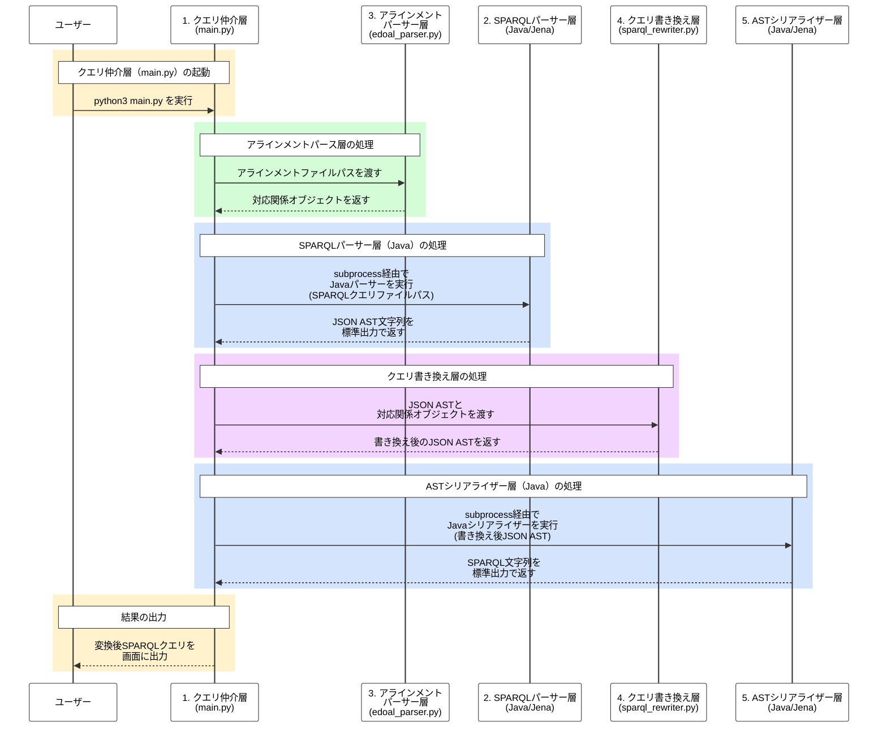

```mermaid
%%{init: {'theme':'base', 'themeVariables': { 'actorBkg':'#ffffff','actorBorder':'#333','actorTextColor':'#000','actorLineColor':'#333','signalColor':'#333','signalTextColor':'#000','labelBoxBkgColor':'#fff','labelBoxBorderColor':'#333','labelTextColor':'#000','loopTextColor':'#000','noteBorderColor':'#333','noteBkgColor':'#fff','noteTextColor':'#000','activationBorderColor':'#333','activationBkgColor':'#f4f4f4','sequenceNumberColor':'#fff'}}}%%
sequenceDiagram
    participant User as ユーザー
    participant Main as 1. クエリ仲介層<br/>(main.py)
    participant EParser as 3. アラインメント<br/>パーサー層<br/>(edoal_parser.py)
    participant JavaParser as 2. SPARQLパーサー層<br/>(Java/Jena)
    participant Rewriter as 4. クエリ書き換え層<br/>(sparql_rewriter.py)
    participant JavaSerializer as 5. ASTシリアライザー層<br/>(Java/Jena)

    rect rgb(255, 242, 204)
    Note over User,Main: クエリ仲介層（main.py）の起動
    User->>Main: python3 main.py を実行
    end
    
    rect rgb(212, 252, 215)
    Note over Main,EParser: アラインメントパース層の処理
    Main->>EParser: アラインメントファイルパスを渡す
    EParser-->>Main: 対応関係オブジェクトを返す
    end
    
    rect rgb(212, 228, 252)
    Note over Main,JavaParser: SPARQLパーサー層（Java）の処理
    Main->>JavaParser: subprocess経由で<br/>Javaパーサーを実行<br/>(SPARQLクエリファイルパス)
    JavaParser-->>Main: JSON AST文字列を<br/>標準出力で返す
    end
    
    rect rgb(243, 212, 255)
    Note over Main,Rewriter: クエリ書き換え層の処理
    Main->>Rewriter: JSON ASTと<br/>対応関係オブジェクトを渡す
    Rewriter-->>Main: 書き換え後のJSON ASTを返す
    end
    
    rect rgb(212, 228, 252)
    Note over Main,JavaSerializer: ASTシリアライザー層（Java）の処理
    Main->>JavaSerializer: subprocess経由で<br/>Javaシリアライザーを実行<br/>(書き換え後JSON AST)
    JavaSerializer-->>Main: SPARQL文字列を<br/>標準出力で返す
    end
    
    rect rgb(255, 242, 204)
    Note over Main,User: 結果の出力
    Main-->>User: 変換後SPARQLクエリを<br/>画面に出力
    end
```
